# Slycrel

An open-world sword-and-sorcery RPG in Go. Walk a generated continent, wander
into places that are worse than they look, fight things in a turn-based battle
screen, sell their component parts to a man who does not meet your eye.

Descended from **Slycrel**, a text RPG door game written in Pascal for the
Hermes II BBS on Mac Classic circa 1994–96 by Dave Dolinar and Jeremy Stone,
later ported to C++ by Bill Dolinar, and recreated in Go in `../new-slycrel`.
This project is a fresh world built on the old bones: the combat, levelling,
and initiative maths in `internal/rules` are a direct port, so the balance has
already been playtested by a few hundred BBS users, three decades ago.

The humour is bawdy and the violence is comic, and the tone-setting rule is
that nobody in the world ever acknowledges the joke.

| | |
|---|---|
| 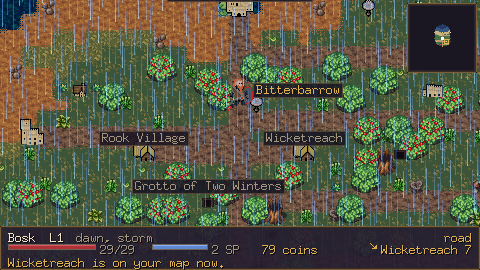 | 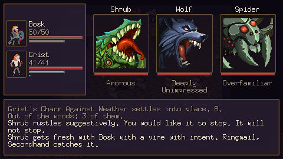 |
| Overworld — roads, terrain, points of interest | Battle — portraits, transcript, commands |
| 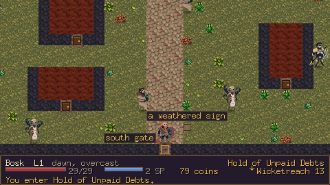 | 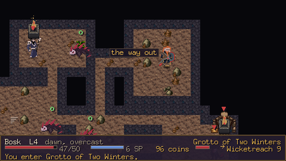 |
| Town — generated from the location's seed | Dungeon — rooms, foes, chests, a boss |
| 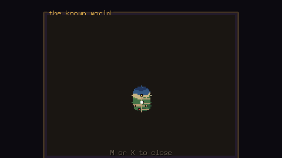 | 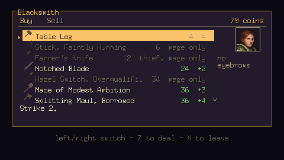 |
| The map — only what you have walked past | A shop, with icons |
| 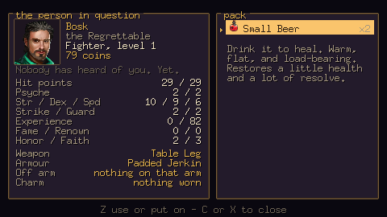 | 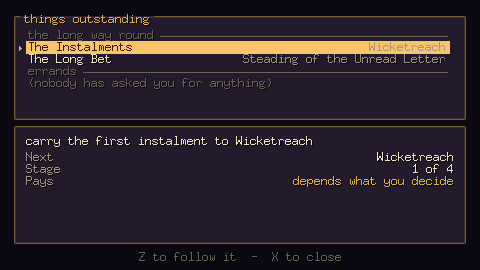 |
| Character sheet and pack | Errands, generated from the world |
| 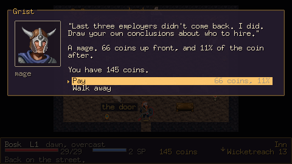 | 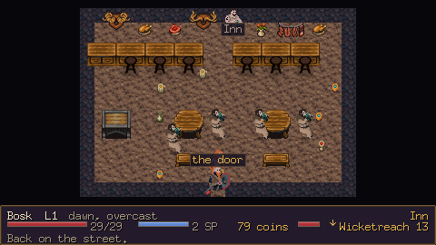 |
| Hiring — cheaper, because he is part demon | The company, following you around |
| 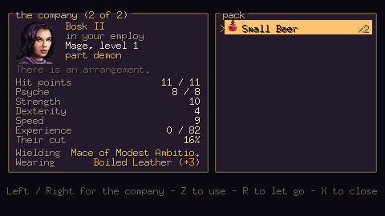 | 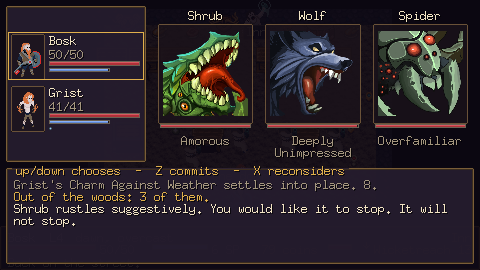 |
| A hireling's sheet, ancestry and all | Choosing who an effect lands on |

## Running it

**Just want to play it?** [Grab a build from
Releases](https://github.com/slycrel/slycrel-rpg/releases/latest) — macOS
universal or Windows, art and audio included, nothing to install. Neither is
code-signed, so the first launch needs right-click → Open on a Mac, or "More
info" → "Run anyway" on Windows.

To run it from source, double-click **`play.command`**. It builds this checkout
and launches it, so there is never a stale binary to wonder about — the title
and pause screens show which commit is running.

From a terminal, the same flags work either way:

```bash
./play.command -seed 1994          # build and play a fixed continent
go run ./cmd/slycrel               # a new continent every launch
go run ./cmd/slycrel -seed 1994    # the same continent every time
go run ./cmd/slycrel -scale 4      # bigger window (integer scales only)
go run ./cmd/slycrel -audit        # check content against the art manifest, then exit
go run ./cmd/slycrel -load saves/fixtures/battered.json   # start from a save
go run ./cmd/slycrel -mute        # run silent
```

The seed is also typeable on the character screen — the World row at the top
takes a number, and left/right rolls a fresh continent — so a seed somebody
tells you about does not have to come in through the command line.

`-load` takes any save file, which makes saves useful as test fixtures. The
`-demo` tour leaves one at `saves/demo.json`, and `saves/fixtures/` holds a
hand-curated set parked in the states that are otherwise a chore to reach:

```bash
go run ./cmd/slycrel -load saves/fixtures/full-company.json  # party at the cap, one part demon
go run ./cmd/slycrel -load saves/fixtures/battered.json      # nearly dead, one companion down
go run ./cmd/slycrel -load saves/fixtures/inside.json        # standing inside a location
go run ./cmd/slycrel -load saves/fixtures/v1-solo.json       # a save from before the party existed
```

They are also a regression net that needs no display — see **Testing** below.

Requires Go 1.25+. The art lives outside the repo; see **Assets** below.

## Controls

| | |
|---|---|
| Arrows / WASD | walk — and walking into a thing is how you use it |
| Z, Enter, Space | confirm; any key dismisses a box that is only telling you something |
| Left / Right | in the technique list, what the highlighted move actually does |
| X, Esc | back out |
| M | the full map; a corner of it is always on screen, marked with whatever you are following |
| C or I | character sheet and pack; left/right pages through the company |
| G / T | on a companion's sheet, give them the selected item or take it all back |
| R | on a companion's sheet, let them go |
| Tab | at a shop counter, change who you are buying for |
| Z at a counter | sells the whole stack; the first row clears out the junk in one go |
| J | the errands you agreed to; Z on one follows it, and the compass points at it |
| Esc | pause: save, load, settings, abandon the run |
| `\` or F12 | screenshot to `shots/` (F12 needs standard function keys on macOS) |

## What is in the box

- **A generated continent** — 160×120 tiles of coast, forest, hills, mountains,
  mire, desert and scorched waste, with rivers that run downhill to the sea and
  roads that connect every settlement to the capital. Danger radiates outward
  from the capital, so walking somewhere you should not be is punished
  immediately rather than when the plot says so.
- **~40 points of interest** per world — capital, towns, villages, castles,
  dungeons, caves, ruins, towers, shrines, camps, and whatever an "oddity"
  turns out to be this time. Each generates its own interior on demand from its
  seed, so leaving and coming back gives you the same town without storing it.
- **Turn-based battles** against up to four monsters, with initiative,
  targeting, techniques, items, defending, and fleeing.
- **A party** — up to two hirelings, found loitering outside inns. They cost a
  fee up front and a standing cut of every haul afterwards, and they are never
  commanded: you drive your own hero and they make their own decisions, running
  the same policy the balance simulator plays, with triage first — somebody on
  the floor, then somebody about to be, then whatever is causing it. They walk
  behind you in a line that follows your path rather than your position, take
  hits that would otherwise be yours, level on their own curve, and spend their
  cut re-arming so a companion hired at level three is still worth having at
  twelve.
- **Outfitting the company** — the shop counter turns to whoever you point it
  at with Tab, so a hireling can be given a weapon, a shield or a charm out of
  your purse. Supplies bought for them go in *their* pack, and they drink them
  without asking when a fight turns: a companion never reaches into yours, so
  what they have is what you gave them. Everything comes back when you let them
  go, which is what makes stocking somebody up a purchase rather than a bet.
- **Hirelings who are not entirely people** — about one in three is part beast,
  fey, undead, demon, ooze or something nobody has established. Each lineage
  shifts the stat line in both directions, comes with a discount because nobody
  else in town will take them, and carries one technique gated on ancestry that
  no hero of any class or level can ever learn. That is most of the reason to
  hire the cheap one on the corner.
- **Conditions that linger** — poison and burning tick at the end of each round,
  weakness and blessings change what a blow is worth, a stun costs a turn. One
  timed list on each combatant rather than the four separate mechanisms the
  battle screen used to carry, so anything can be given a duration without
  inventing a fifth. Fourteen creatures leave something behind when they land a
  hit — a spider's bite is worth more than its damage roll suggests — which is
  what stops the roster's stat lines being the whole story about which monster
  you would rather meet. Antidotes take the harm and leave the help.
- **Two sides to every effect** — which half of the field an effect lands on is
  derived from what it does rather than stored next to it, so a heal cannot be
  aimed at a monster and a stun cannot be aimed at a friend. Anything that helps
  — a heal, a blessing, standing somebody back up, a potion out of the pack —
  can be pointed at whoever needs it. With nobody else in the party the cursor
  is skipped, so playing alone never got slower.
- **Getting back up** — a companion out of hit points is out of the fight, not
  dead, and stands up when it ends; an item or the right technique gets them up
  sooner. A hero who falls with somebody still standing is carried to the
  nearest town for a large share of the purse and a point of Shame. A hero who
  falls alone still loses the run, so the company is the thing that buys the
  ending off rather than the game going soft.
- **62 monsters** across nine biomes, each with its own attack verbs, defensive
  flavour, taunts, death lines, drop table, and — for a minority of them —
  something they leave in you.
- **Shops, inns, chests, altars and townsfolk** who all have opinions — about
  your reputation, and sometimes about the state you are visibly in. Anybody
  holding something for you wears a star, and reads as "someone" until you are
  near enough to be told a name. Shops and inns are signposted from anywhere in
  the town, because that one is directions rather than description.
- **Quests** — generated from the world rather than written against it. Someone
  in a town wants four pelts, or a cave cleared, or a parcel carried two days
  east. The generator only ever names things it has checked exist, so an errand
  is never impossible; a quest is a few indices and a counter, so it costs
  nothing to save.
- **Four equipment slots** — weapon, armour, shield and charm. Shields go to the
  smith and charms to the armourer, and both are a trade rather than an upgrade:
  a tower shield blocks more and slows you down, a courier's anklet buys speed
  with strength. What the dice actually use is the total across all four, so a
  charm that raises strength really does raise the damage roll.
- **Each class fights in its own lane.** Five kinds of weapon and three weights
  of armour, gated hard: a two-hander is a fighter's and takes the shield arm
  with it, a mage wears cloth and holds a wand, a thief buys dexterity where the
  fighter buys plate. The shelf greys out what you cannot take and says who
  could, rather than selling you something that turns out to be for somebody
  else.
- **A wand attacks for free.** A focus weapon carries Focus instead of Strike:
  it makes every technique land harder, and the ordinary Attack becomes a bolt
  that costs no psyche and goes through whichever of the target's defences is
  thinner. So a mage is casting all the time and paying only for the big ones —
  and technique itself is priced by class, cheapest for the mage and dearest for
  the fighter.
- **Techniques that are not just a bigger swing.** Two of them have two sides: a
  *sap* takes the edge off everything opposite and puts it on you, and a *pact*
  hits far above its band and leaves you wearing the difference for the rest of
  the fight. The menu quotes both halves before you commit.
- **The off arm is a choice, not a ladder.** Every band stocks a wall, a
  silvered shield that trades guard for anti-magic, and a spiked one you hit
  with. For most of the game the choice barely matters and the numbers say so;
  at the top of it, it is worth nine points of whether you walk away from a
  fight you should not have taken. The shelf grades each against its own lane
  rather than pretending they are three grades of the same thing.
- **A caster's off arm.** A mage cannot hold a shield and cast at the same time,
  so what goes on that arm instead is a talisman: a pool of absorption that
  every blow comes off before it reaches you, of any kind, until it is spent.
  A shield shaves a little off every hit forever; a barrier stops a lot of one
  and is then gone for the fight.
- **Camping.** A level at the top of the game costs seven round trips to an inn;
  a camp kit is half of both pools back where you stand. It does not fill you
  up, wake you at dawn or save the run — those are what a bed is for — and
  something may well walk into the camp, which is likelier on a clear night, far
  from home, and indoors.
- **You get your breath back.** Walk away from a fight — won or run from — and
  part of what it cost comes straight back, more of the psyche than the blood.
  A share of the spend rather than the pool, so it is a discount on the
  encounter and never a way to outrun it.
- **Affixes** — "of the Damp", "of Poor Decisions", "of Consequences". Authored
  rather than rolled from a range, each one giving with one hand and taking with
  the other, and banded so a level-two hand-axe cannot turn up "of
  Consequences". They are found in chests rather than sold, because a shop is
  where you buy the tier you can afford and a chest is where you find the thing
  with a name on it. A find is offered rather than equipped: with every affix a
  trade, whether it beats what you are holding is a real question, and the box
  spells out what the suffix is worth before you answer. Gear whose name already
  ends in a flourish never gets a second one.
- **Encounters have a shape.** Not every fight is an assortment: a pack is more
  of them and quicker, a brute is one of them and enormous, an escort is
  something magical standing behind something armoured, and a mismatch is two
  creatures that are not the same problem. The transcript says which before you
  choose.
- **Oddities** — a short paved strip in the middle of nowhere with a stairway
  going down at the end of it, a lit humming box that takes a coin and gives you
  something cold, signage in a script nobody writes, and villagers who find none
  of it remarkable. Nobody standing there is in on it. The things that live
  there are bureaucrats: plated, unhurried, and entirely within their remit.
- **Icons** — every item, weapon, suit of armour and technique carries one, in
  the bag, the shop and the battle menu. Reduced to 16px in the pipeline rather
  than scaled at draw time, because the engine samples nearest-neighbour and a
  128px painted icon squeezed into a 16px box keeps every eighth pixel.
- **Scenery** — trees, boulders, ferns, reeds and cacti outdoors; pots, sacks
  and books in houses; moss and stalagmites underground. All scattered over the
  terrain that suits them, placed from a hash of position and world seed so a
  wood looks the same every time you walk back into it without a byte of it
  being stored.
- **Blended terrain** — real pixel-art ground textures with quarter-tile
  autotiling, so grass fringes dirt and sand fringes the sea instead of meeting
  at hard grid edges. Roads outrank the land they cross; rock and snow sit on
  top of everything.
- **Sound** — 33 cues drawn from the bundle's sound packs: combat impacts,
  interface clicks, coins, chests, and four looping ambience beds that follow
  the ground underfoot. Each cue has several source files and picks one at
  random, so a sword landing forty times does not click the same way twice.
  There is also a retired magician who occasionally comments on your victories.
- **Save and load** — three slots, reachable from the pause menu (Escape) or
  Continue on the title. A save is the seed plus whatever you changed, so it is
  a few kilobytes of readable JSON rather than a dump of the map. The format is
  at v2 (the party arrived in it) and still reads a v1 save, which describes a
  run with nobody in it.

## Project layout

```
cmd/
  slycrel/            the game
  assetpipe/          inventory, extract, and index the source art bundle
  balance/            simulate the curve over the real rules
  genfixtures/        rewrite the save fixtures after a world-generation change
internal/
  core/               RNG that forks deterministically, grid maths, the tile walker
  model/              characters, monsters, gear, spells, conditions
  rules/              combat / levelling / loot / effect maths, ported from the original
  party/              the company roster and the line that follows you
  world/              continent generation, terrain, points of interest, interiors
  gamedata/           JSON content loading
  content/            the writing room: names, signs, taunts, combat narration
  assetsys/           art registry, frame slicing, generated placeholders
  render/             camera, sprites, text, the fixed 480x270 framebuffer
  ui/                 panels, meters, menus, message log
  game/               scene stack and every screen
data/
  monsters/           one file per biome
  items/              weapons, armor, shields, charms, affixes, consumables, spells
  text/               the word banks the generators recombine
assets/manifest.json  asset key -> file, generated by assetpipe
docs/                 the plan, and the asset inventory
```

## Assets

The art comes from the Humble *Complete RPG Creator Bundle* — 78 packs, 56,409
files, 16.7 GB. None of it is committed. `assets-raw/` is gitignored and
rebuilt from the purchased zips on demand:

```bash
go run ./cmd/assetpipe inventory        # writes docs/ASSET-INVENTORY.md
go run ./cmd/assetpipe extract tier1    # the ~33 packs the game currently uses (2.8 GB)
go run ./cmd/assetpipe manifest         # index art into assets/manifest.json
go run ./cmd/assetpipe audio            # index sound into assets/audio.json
go run ./cmd/assetpipe props            # rewrite prop sheets with real translucent shadows
go run ./cmd/assetpipe icons            # box-reduce the icon sets to 16px
go run ./cmd/assetpipe find viking walk # locate a file in what is extracted
```

Set `SLYCREL_BUNDLE` if the bundle is not at `~/Desktop/RPG Maker Stuff`.

Anything the manifest does not cover is generated procedurally at runtime, so
the game always runs and curation can proceed one asset at a time without ever
leaving the build broken. Terrain still autotiles with generated textures if
the bundle is absent; only the look changes, not the behaviour.
`-audit` reports exactly what is still falling back, and decodes every sound
file to prove the cues will actually play rather than just that the JSON
parsed.

## Shipping a build

```bash
./make-dist.command               # both platforms, into dist/ (double-clickable)
./make-dist.command mac           # just one
./scripts/dist.sh windows amd64   # single platform, no universal binary
./scripts/licenses.sh             # refresh licenses/ after a dependency change
```

`make-dist.command` is the one that produces a release. It runs the content
audit first and refuses to package if a single art key would render as a
placeholder, then stages only the files the two manifests name — 99 MB of the
16.7 GB bundle — and zips one folder per platform. The macOS build is a
universal binary, so a friend does not have to know which machine they have.
Around 86 MB a side, and it runs standalone.

`scripts/dist.sh` is the older single-target script, kept because it is the one
that cross-compiles to an arbitrary GOOS/GOARCH pair.

Ebitengine reaches DirectX and Win32 through purego, so **Windows
cross-compiles cleanly with nothing but Go**. macOS and Linux need cgo and must
be built on the platform they target.

The binary finds `data/` next to itself as well as via the working directory, so
a double-clicked build works even though its working directory is `/`.

Builds contain third-party art and audio. Shipping that inside a game is
licensed; publishing the folder as an asset pack is not. `dist/` is gitignored.

## Balance

```bash
go run ./cmd/balance          # win rates, endurance, progression, economy
```

The formulas in `internal/rules` are ported from the original; everything
around them — 62 monsters' stats, the gear tables, prices — was invented, and
the simulator is how those get checked against each other. It runs the same
code the game plays rather than a copy of it, so what it measures is the game.

Its findings are kept honest by tests: `TestDamageHasNoCliff`,
`TestOnLevelFightsAreWinnable`, `TestDangerRadiatesOutward` and
`TestEnduranceHoldsAcrossLevels` assert the *shape* of the curve, so content
can be added freely but progression cannot silently break.

The party is deliberately kept out of that curve rather than folded into it.
Experience is not divided — every member banks the full award and levels
separately — so the hero's progression is exactly what the simulator measured
whether or not anyone is walking behind them. What a companion costs instead is
coin (a fee, a cut, a bed each at the inn) and a bigger crowd at every
encounter, both of which are levers that can be turned without re-tuning the
damage formulas.

Lineages are held to the same rule from the other direction: every one of the
six gives with one hand and takes with the other, and a test asserts it, so a
part-monster hireling is a different shape of companion rather than a better
one. Their discount is the reward for the trade-off, not for a bargain.

Conditions are inside the simulation rather than beside it. When fourteen
creatures started leaving poison and fire behind, `SimulateFight` learned to
apply and tick them too — otherwise the report would rate a venomous spider by
its bite alone and call the swamp safer than it is. It moved the numbers where
it should: an over-level fight in the swamp went from 97.2% to 95.6%, and the
band's hit points left dropped four points. The rule the whole report depends on
is that it plays the game's own code, and a mechanic the simulator cannot see is
a mechanic the balance pass is lying about.

The equipment pass is a worked example of the report doing its job. Adding two
slots pushed the hardest column — a fight three levels over your head — from
80-95% up to 90-100%, which is the tension gone. Two things were wrong. The
shields were simply too strong: at the first tier one nearly doubled a
character's total defence. And the "on curve" assumption had quietly become
best-in-tier across *four* slots, which is not a character anybody can afford.
Sidearms now come a band behind the weapon and the armour, and not at all in the
first one — a new character has twenty coins and a decision to make about
potions. Levels one to three came back byte-identical to before the feature, and
from level four a fully kitted character is three or four points better on the
hardest column. That is what two more purchases should buy.

One gap is known and deliberate: the simulated player never *casts* poison or
burning, because its policy compares a technique against a weapon swing by
single-hit power and damage over time does not fit that comparison. The report
is therefore conservative — it measures a character who has those techniques and
declines to use them. Understating the player is the safe direction for a report
whose question is "can you survive this", but it is the next thing to fix in the
policy.

## Testing

```bash
go test ./internal/...
```

The save fixtures in `saves/fixtures/` are the cheapest coverage in the project.
A save is the world seed plus what the player changed, so loading one asserts
three things that otherwise rot in silence: that the seed still generates the
same continent, that the content the file names by string still exists, and that
the format is still readable. Between them the set covers a full company, a
part-monster hireling, a companion on the floor, a party inside a location, a
solo run, and a file written before the party existed — and a test asserts that
coverage, so the set cannot quietly decay into six copies of "level one,
standing in a field".

Regenerate them with `go run ./cmd/genfixtures` after a deliberate change to
world generation. It leaves `v1-solo.json` alone: that file's job is to *be* an
old save, and rewriting it at the current version would delete the only evidence
that the loader still reads the previous format.

The first thing the fixtures caught was a flaw in themselves. They were
generated against a stub namer, and because location names are drawn from the
same generator that places the locations, a namer consuming no randomness builds
a *different* continent — so the game rejected the fixture as predating a world
change that had never happened. Anything checking a save against its world has
to regenerate the world the game would, with the real writer.

Six of the nine packages have no path to Ebitengine and run anywhere — `core`,
`model`, `rules`, `party`, `gamedata`, `save` and `quest` between them hold most
of the assertions. That is deliberate. Ebitengine initialises a window at
package init on macOS, so a package that imports it cannot start without a
display, and a laptop that has locked its screen fails every test in it. Keeping
the rules, the roster and the marching order out of the scene layer means the
logic most likely to be wrong is also the logic that can always be run.

They target the things that fail silently: loot tables referring to items that
do not exist, a biome with no spawnable monsters, an XP curve that stops being
monotonic, world seeds that generate an uninhabitable island, and interiors
with no exit.

For the visual half there are two more tools. 
```bash
go run ./cmd/slycrel -demo     # scripted tour: one frame per screen into shots/
go run ./cmd/slycrel -keylog   # trace every key the engine reports, to stderr
```

`-demo` drives the scene stack directly rather than faking input, so a captured
frame never depends on input timing. It is the fastest way to find a panel that
draws off-screen — and it is how the bug where `Replace` quit the game on the
title screen was caught.

To drive the *real* input paths from a script on macOS, note that the terminal
takes focus back the instant the shell command returns, so focusing and typing
have to happen inside one `osascript` invocation:

```applescript
tell application "System Events"
  set frontmost of process "slycrel" to true
  delay 0.8
  key code 6    -- z, confirm
  key code 125  -- arrow down, walk
  key code 42   -- backslash, screenshot to shots/
end tell
```

This needs Terminal to hold **Accessibility** permission (System Settings →
Privacy & Security). It does *not* need Screen Recording: the backslash binding
dumps the game's own framebuffer, which is cleaner than a screen grab because
it captures exact pixels with no window chrome or display scaling. Note that
F12 also works but only if function keys are set to standard on macOS.

## Licence

**Everything in this repository is MIT** — engine, rules, content tables, docs,
the asset pipeline, the manifest. There is no carve-out, because no art or audio
is committed here in the first place.

**The art and audio are separately licensed and live outside version control.**
They come from a commercial bundle, belong to their creators, and are not
required to run the game — anything missing falls back to a generated
placeholder.

| | |
|---|---|
| [LICENSE](LICENSE) | MIT, covering this repository |
| [NOTICE](NOTICE) | what is and is not covered, and why |
| [CREDITS.md](CREDITS.md) | the creators |
| [licenses/](licenses/THIRD-PARTY.md) | vendored licences for every linked Go module |
| [docs/ASSET-LICENSING.md](docs/ASSET-LICENSING.md) | what the asset licences permit and forbid |
| [docs/ASSET-INVENTORY.md](docs/ASSET-INVENTORY.md) | what is in the bundle |

Note for anyone building a release: shipping a compiled game with the art packed
into it **is** permitted, and players need no bundle of their own. The art is
kept out of this repository because a public repository would hand over the
assets *as assets*, which is the thing the licences actually forbid.

## History

- **1994–96** — original Pascal version, Hermes II BBS (Dave Dolinar, Jeremy Stone)
- **1997–2000** — C++ port (Bill Dolinar)
- **2026** — Go recreation of the original, `../new-slycrel`
- **2026** — this: the open-world one
